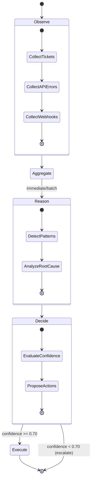

# SupportPilot Architecture

## LangGraph State Machine



## Data Flow

```
┌─────────────┐    ┌─────────────┐    ┌─────────────┐
│   Tickets   │    │  API Logs   │    │  Webhooks   │
│   (JSON)    │    │  (Splunk)   │    │  (Events)   │
└──────┬──────┘    └──────┬──────┘    └──────┬──────┘
       │                  │                  │
       └──────────────────┼──────────────────┘
                          │
                          ▼
              ┌───────────────────────┐
              │    OBSERVER AGENT     │
              │ ───────────────────── │
              │ • Signal collection   │
              │ • Anomaly detection   │
              │ • Priority tagging    │
              └───────────┬───────────┘
                          │
                          ▼
              ┌───────────────────────┐
              │   AGGREGATOR NODE     │
              │ ───────────────────── │
              │ • Signal correlation  │
              │ • Priority routing    │
              │ • Batch optimization  │
              └───────────┬───────────┘
                          │
            ┌─────────────┴─────────────┐
            │                           │
    ┌───────▼───────┐           ┌───────▼───────┐
    │   IMMEDIATE   │           │     BATCH     │
    │   (Critical)  │           │   (Low-Med)   │
    └───────┬───────┘           └───────┬───────┘
            │                           │
            └─────────────┬─────────────┘
                          │
                          ▼
              ┌───────────────────────┐
              │   REASONING AGENT     │
              │ ───────────────────── │
              │ • Pattern detection   │
              │ • Gemini AI analysis  │
              │ • Root cause finding  │
              │ • Hypothesis gen      │
              └───────────┬───────────┘
                          │
                          ▼
              ┌───────────────────────┐
              │   DECISION AGENT      │
              │ ───────────────────── │
              │ • Action proposal     │
              │ • Risk assessment     │
              │ • Confidence scoring  │
              │ • Approval routing    │
              └───────────┬───────────┘
                          │
            ┌─────────────┼─────────────┐
            │             │             │
    ┌───────▼───────┐ ┌───▼───┐ ┌───────▼───────┐
    │  AUTO (≥90%)  │ │ APPROVE│ │ ESCALATE(<70%)│
    │   Execute     │ │ (70-90)│ │   to Human    │
    └───────┬───────┘ └───┬───┘ └───────────────┘
            │             │
            └──────┬──────┘
                   │
                   ▼
           ┌───────────────────────┐
           │    EXECUTOR AGENT     │
           │ ───────────────────── │
           │ • Action execution    │
           │ • Self-healing ops    │
           │ • Status reporting    │
           └───────────────────────┘
```

## Agent Autonomy Matrix

| Agent | Input | Autonomous Actions | Output |
|-------|-------|-------------------|--------|
| **Observer** | Raw tickets, API logs | Parallel collection, anomaly flagging, severity tagging | Structured signals |
| **Aggregator** | Signals | Priority classification, route selection | Routing decision |
| **Reasoner** | Aggregated signals | Pattern detection via LLM, hypothesis generation | Root cause analysis |
| **Decider** | Analysis results | Confidence scoring, risk evaluation, action proposal | Decision + confidence |
| **Executor** | Approved actions | Remediation execution, rollback if failed | Completion status |

## Confidence-Based Routing

```python
if confidence >= 0.90:
    route = "auto"       # Execute immediately without human
elif confidence >= 0.70:
    route = "approve"    # Execute after human approval
else:
    route = "escalate"   # Route to support team
```

## Key Autonomous Behaviors

1. **Self-Triage**: Observer classifies signal severity without human input
2. **Dynamic Workflow**: Graph adapts path based on real-time conditions
3. **Confidence Gating**: High-confidence actions auto-execute
4. **Graceful Degradation**: Low confidence triggers human escalation
5. **Tool Orchestration**: Agents invoke tools (Splunk, APIs) independently
