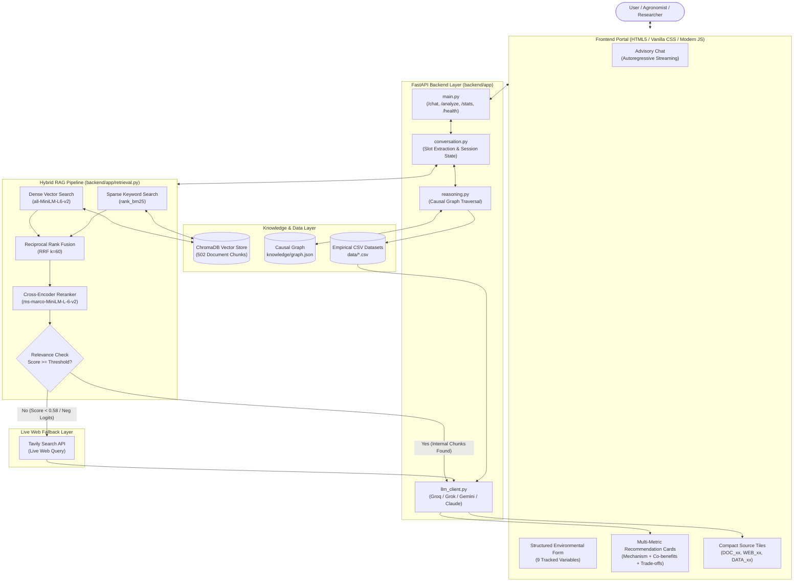
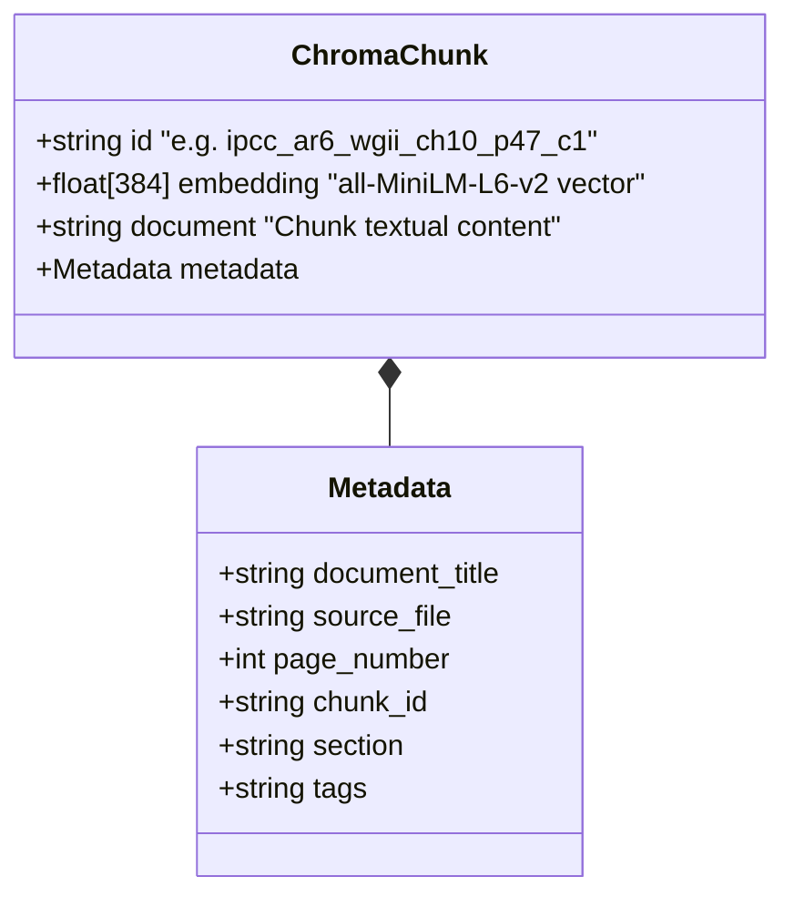
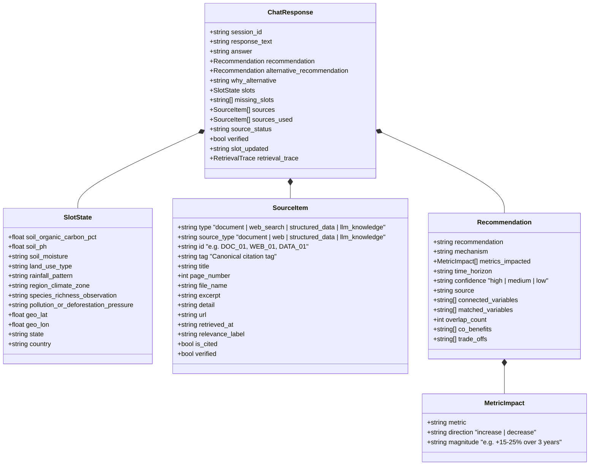
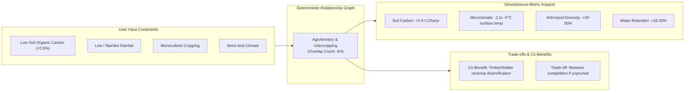
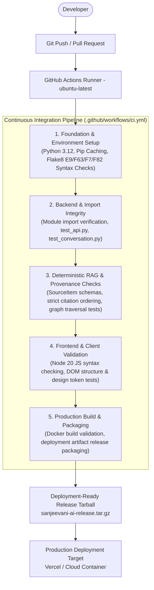

# 🌱 Sanjeevani AI — Biodiversity Intelligence Advisory System

> **An auditable, evidence-backed environmental decision-support system coupling a hybrid RAG pipeline (dense semantic vector search + BM25 sparse keyword retrieval + cross-encoder reranking) with a deterministic causal relationship graph, multi-tier provenance citation, and active slot-filling conversational intelligence.**

[](https://sanjeevani-ai-ten.vercel.app)
[](.github/workflows/ci.yml)
[](requirements.txt)
[](chroma_db/)
[](https://huggingface.co/sentence-transformers/all-MiniLM-L6-v2)
[](https://huggingface.co/cross-encoder/ms-marco-MiniLM-L-6-v2)

**Live Production URL:** [https://sanjeevani-ai-ten.vercel.app](https://sanjeevani-ai-ten.vercel.app)  
**Submission for:** *Darukaa.Earth AI Biodiversity Intelligence Chatbot Challenge*

---

### Project Overview

Generic large language models (LLMs) are notorious for generating hallucinated ecological figures, recommending monoculture-friendly fixes in fragile drylands, and failing to provide auditable scientific grounding. In contrast, **Sanjeevani AI** operates as an **AI Environmental Scientist and Decision-Support System**. 

Rather than generating ungrounded prose, Sanjeevani AI:
1. Tracks **9 key environmental variables** (soil organic carbon, pH, soil moisture, land-use type, rainfall pattern, climate zone, species richness, pollution/deforestation pressure, and geospatial location).
2. Traverses a **deterministic causal relationship graph** (`knowledge/graph.json`) that models ecological preconditions, multi-variable constraints, and quantifiable trade-offs.
3. Queries a **production-grade hybrid RAG pipeline** combining 384-dimensional dense semantic vectors (`all-MiniLM-L6-v2`) in **ChromaDB** with BM25 sparse keyword search and **Cross-Encoder reranking** (`ms-marco-MiniLM-L-6-v2`) over 502 chunked sections of peer-reviewed literature (IPCC AR6 WGII, FAO, IPBES).
4. Employs a **multi-tier verification architecture**: internal knowledge documents $\rightarrow$ live web search retrieval $\rightarrow$ transparently identified AI fallback.
5. Preserves **strict provenance tracking**, mapping every assertion to exact document chunks, page numbers, real CSV datasets, or verified web URLs.

---

## 1. Problem Statement

Global terrestrial ecosystems face an interrelated crisis: soil degradation, accelerated biodiversity loss, climate instability, and land-use pressure. Environmental management cannot be effectively solved by isolating individual variables:
- **Soil Organic Carbon (SOC)** directly dictates microbial biomass, moisture retention capacity, and biological nitrogen fixation; yet increasing SOC requires understanding local rainfall patterns and tillage history.
- **Land Use & Habitat Fragmentation** undermine native pollinators and natural pest predators; yet introducing tree buffers or hedgerows without accounting for regional soil pH and water competition can trigger crop yield collapse.
- **Climate Pressures & Heat Extremes** interact with localized drainage, causing soil salinization in arid irrigated zones or severe runoff in deforested catchments.

Because ecological systems operate through nonlinear feedbacks and tight trade-offs, land managers, agronomists, and policy researchers require an advisory platform that **reasons across multiple environmental variables simultaneously**. Interventions must specify clear mechanisms, quantified impacts across multiple metrics, operational time horizons, and rigorous citations from scientific literature.

---

## 2. Solution Overview

Sanjeevani AI executes a disciplined, multi-stage pipeline for every interaction:

```
[User Input] (Conversational Query or Structured JSON Form)
      │
      ▼
[Active Slot Extraction & State Management] (Tracks 9 Environmental Parameters)
      │
      ├── Case A: Informational Question (General Q&A)
      │     └── Hybrid RAG Retrieval -> Threshold Validation -> Tiered Fallback -> Grounded Answer
      │
      └── Case B: Advisory Context (Site Conditions Provided)
            └── Causal Relationship Graph -> Precondition Matching (>=2 overlaps)
                -> Metric Impact Calculation -> Hybrid RAG Document Evidence Retrieval
                -> Real Numeric CSV Grounding -> Structured LLM Synthesis
```

### Multi-Tier Knowledge & Fallback Architecture

To ensure zero false citations and 100% auditable provenance, Sanjeevani AI enforces a strict three-level retrieval hierarchy:

1. **Level 1 — Internal Knowledge Retrieval (ChromaDB + Graph + Datasets)**:
   - Queries the local ChromaDB collection (`biodiversity_knowledge_v2`, 502 chunks from IPCC AR6 WGII chapters and reports).
   - Validates relevance against strict cross-encoder and cosine distance thresholds ($\text{cosine similarity} \ge 0.58$, $\text{BM25 score} \ge 3.0$, $\text{rerank logit} \ge 0.0$).
   - Integrates empirical numeric CSV datasets (`data/Crop_recommendation.csv`, `data/GlobalLandTemperaturesByCountry.csv`, `data/Country carbon data.csv`).
   - Cites internal evidence chunks as `[DOC_01]`, `[DOC_02]` with file names and exact page numbers.

2. **Level 2 — Live Web Retrieval Fallback (Tavily Search API)**:
   - Triggered automatically if internal retrieval returns zero chunks above the acceptance threshold (e.g. for niche modern agronomical practices or specific regional guidelines not present in local IPCC reports).
   - Queries the Tavily Search API for authoritative agricultural and ecological sources.
   - Synthesizes answers strictly bounded by the retrieved web content, citing live URLs as `[WEB_01]`, `[WEB_02]`.
   - Web cards feature clean domain badges (`🌐 domain.com`), page titles, direct external links (`↗`), and collapsed evidence drawers.

3. **Level 3 — Direct LLM Fallback (Transparently Identified)**:
   - If both internal retrieval and web search yield no verified evidence, the system answers from general model weights.
   - **Critical Rule**: The system explicitly marks the response with `source_status: "unverified_fallback"`, sets `verified: false`, assigns `[AI_01]`, and prefixes the text with `"Based on general knowledge, ..."`. The model is forbidden from inventing citations.

---

## 3. Key Features

| Feature | Implementation Details | Status in Repo |
| :--- | :--- | :---: |
| **Hybrid RAG Pipeline** | Dense embeddings (`all-MiniLM-L6-v2`) + BM25 sparse search (`rank_bm25`) + RRF fusion ($k=60$) + Cross-Encoder reranking (`ms-marco-MiniLM-L-6-v2`) | ✅ Active |
| **Vector Knowledge Base** | 502 indexed chunks in ChromaDB (`chroma_db/`) parsed from official IPCC AR6 WGII PDFs | ✅ Active |
| **Causal Relationship Graph** | 12 modeled interventions with multi-variable preconditions, directional metric impacts, co-benefits, and trade-offs (`knowledge/graph.json`) | ✅ Active |
| **Active Slot-Filling State** | 9 tracked environmental slots extracted via LLM/heuristic parsing across multi-turn conversation (`backend/app/conversation.py`) | ✅ Active |
| **Clarifying Question Loop** | Automatically requests missing mandatory parameters when fewer than 3 variables are identified | ✅ Active |
| **Multi-Tier Live Web Search** | Automatic fallback via Tavily Search API when internal document relevance falls below threshold | ✅ Active |
| **Real CSV Dataset Grounding** | Regional temperature anomalies, crop pH/rainfall ranges, and national carbon data (`data/*.csv`) | ✅ Active |
| **Strict Provenance System** | `DOC_xx` (page/file), `WEB_xx` (URL/domain), `DATA_xx` (CSV detail), `AI_xx` (unverified notice) | ✅ Active |
| **Dual Input Modes** | Natural language conversational chat + direct structured variable form (`/analyze`) | ✅ Active |
| **Autoregressive Streaming UI** | Word-by-word streaming generation effect with pulsing cursor (`▌`) and smooth scrolling | ✅ Active |
| **Compact Source Cards** | Modern ChatGPT/Claude style source tiles with domain chips, page pills, and collapsible evidence inspect drawers | ✅ Active |
| **Multi-Model LLM Engine** | Pluggable support for Groq (`qwen/qwen3.8-27b`), Grok (`grok-2-latest`), Google Gemini, Claude, and OpenAI | ✅ Active |
| **Geospatial Awareness** | Slot support for `geo_lat`, `geo_lon`, `state`, `country` mapped to climate datasets | ✅ Active |
| **CI/CD & Testing** | GitHub Actions workflow executing flake8 linting, Pytest test matrix, and Vercel production deployment | ✅ Active |

---

## 4. System Architecture



### Architectural Layers Explained

1. **Client Interface Layer (`frontend/`)**:
   - Zero-framework, ultra-responsive HTML5, CSS3, and JavaScript implementation.
   - Dual-mode layout: Conversational advisory chat on the left; active variable inspector and 9-variable structured form on the right.
   - Progressive autoregressive rendering engine (`addMessageAutoregressive`) with token-by-token visual typing and interactive collapsible evidence drawers.
2. **FastAPI Application Layer (`backend/app/main.py`)**:
   - High-throughput asynchronous endpoints (`/chat`, `/analyze`, `/stats`, `/health`).
   - Lifecycle startup routine validates ChromaDB connection, verifies BM25 corpus initialization, and loads cross-encoder weights into memory.
3. **Conversational Intelligence Layer (`backend/app/conversation.py`)**:
   - In-memory thread state tracking active slots, user turns, and message histories.
   - Intent-aware message classifier distinguishing between factual queries, greeting routines, and environmental parameter submissions.
4. **Graph Reasoning Engine (`backend/app/reasoning.py`)**:
   - Deterministic matching engine evaluating user variable sets against precondition subsets in `knowledge/graph.json`.
   - Requires $\ge 2$ precondition matches for high-confidence primary recommendations.
5. **Hybrid RAG Pipeline (`backend/app/retrieval.py`)**:
   - Multi-stage retrieval combining semantic embeddings, BM25 term frequencies, RRF rank merging, and cross-encoder score thresholding.
6. **External Web Fallback Layer (`backend/app/retrieval.py` & `llm_client.py`)**:
   - Live query augmentation via Tavily API when internal literature lacks sufficient grounding for the user's specific query.

---

## 5. RAG Pipeline

The RAG pipeline implements the step-by-step lifecycle illustrated below:

```
[Raw IPCC PDFs] (in data/)
      │
      ▼
1. Parsing & Header/Footer Stripping (pypdf/pdfplumber, frequency filter)
      │
      ▼
2. Paragraph-Aware Chunking (300–500 tokens, preserving heading hierarchy)
      │
      ▼
3. Contextual Enrichment (Prepends document & section titles to text)
      │
      ▼
4. Dual Artifact Persistence:
   ├── ChromaDB (384-d vectors via all-MiniLM-L6-v2)
   └── JSON Evidence Registry (knowledge/documents/evidence_chunks_real.json)
      │
[Query Time]
      │
      ├── Dense Semantic Search (MiniLM embeddings, top-20)
      ├── Sparse Keyword Search (BM25 tokenized corpus, top-20)
      │
      ▼
5. Reciprocal Rank Fusion (RRF score: Σ 1 / (60 + rank))
      │
      ▼
6. Cross-Encoder Reranking (ms-marco-MiniLM-L-6-v2 evaluates top-10)
      │
      ▼
7. Strict Relevance Threshold Filter:
   ├── Cross-encoder logit >= 0.0 AND Cosine Similarity >= 0.58 ──► Internal Chunks Accepted
   └── All Chunks Below Threshold ──► Fallback Triggered (Tavily Live Web Search)
      │
      ▼
8. Context Assembly & Prompt Construction (Structured with tagged [DOC_xx] or [WEB_xx] headers)
      │
      ▼
9. Grounded LLM Generation (Strict JSON output schema)
      │
      ▼
10. Provenance Mapping & UI Citation Rendering
```

### Contextual Retrieval & Metadata Preservation

In standard RAG systems, isolated chunks lose context (e.g. a chunk discussing "water usage reductions of 20%" does not specify that it applies to semi-arid drip irrigation). 

In Sanjeevani AI (`ingest.py`):
- Each chunk is prepended with its canonical document title and section breadcrumb during embedding generation.
- The original unaugmented text is preserved in ChromaDB metadata for clean UI rendering.
- Metadata attributes stored with every chunk include:
  - `document_title`: Human-readable document name (e.g. *IPCC AR6 WGII Chapter 10: Asia*).
  - `source_file`: The origin PDF file (`IPCC_AR6_WGII_Chapter10.pdf`).
  - `page_number`: Exact integer page number within the official PDF.
  - `chunk_id`: Human-decodable identifier (e.g. `ipcc_ar6_wgii_ch10_p47_c1`).

---

## 6. Knowledge Base

The repository includes a curated corpus of scientific literature and empirical agricultural datasets located in `data/` and `knowledge/`:

### 1. Peer-Reviewed Documents (`data/` & `knowledge/documents/`)
- **IPCC Sixth Assessment Report (AR6 WGII - Impacts, Adaptation and Vulnerability, 2022)**:
  - `IPCC_AR6_WGII_SummaryForPolicymakers.pdf`: High-level global adaptation pathways and ecosystem risk thresholds.
  - `IPCC_AR6_WGII_TechnicalSummary.pdf`: Detailed mechanisms of climate-resilient development and nature-based solutions.
  - `IPCC_AR6_WGII_Chapter10.pdf` & `_SM.pdf`: Asia regional climate vulnerabilities, drought adaptation, and agricultural impacts.
  - `IPCC_AR6_WGII_Chapter18.pdf`: Climate-resilient development pathways and biodiversity conservation.
  - `IPCC_AR6_WGII_CCP1.pdf` & `_SM.pdf`: Cross-Chapter Paper 1 on Global Biodiversity Hotspots.
  - `IPCC_AR6_WGII_CCP5.pdf`: Cross-Chapter Paper 5 on Mountain Ecosystems.
- Total indexed representation: **502 chunks** compiled in `knowledge/documents/evidence_chunks_real.json` and persisted in `./chroma_db`.

### 2. Empirical Numeric Datasets (`data/*.csv`)
- `Crop_recommendation.csv`: Agronomic data containing N, P, K soil ratios, temperature, humidity, pH, and rainfall thresholds for 22 crops.
- `GlobalLandTemperaturesByCountry.csv` & `GlobalLandTemperaturesByState.csv`: Longitudinal historical monthly temperature records spanning over a century.
- `Country carbon data.csv` & `Subnational 1 carbon data.csv`: Regional aboveground biomass and soil carbon estimates.
- `Country tree cover loss.csv` & `Subnational 1 tree cover loss.csv`: Historical canopy cover loss patterns.
- `Species.csv`: Regional species richness observations.

### 3. Causal Relationship Graph (`knowledge/graph.json`)
A hand-curated, peer-reviewed relationship graph modeling 12 agroecological interventions with defined preconditions, multi-metric impacts, effect sizes, time horizons, co-benefits, and trade-offs.

---

## 7. Database & Schema

### ChromaDB Vector Collection Schema

The vector store is instantiated locally via ChromaDB in `./chroma_db` under the collection name **`biodiversity_knowledge_v2`**.



### Backend Pydantic Data Models (`backend/app/schemas.py`)

All API interactions and internal state representations adhere strictly to typed Pydantic models:



---

## 8. Citation & Evidence System

Sanjeevani AI guarantees that **every claim is auditable**. The LLM is structurally constrained to return structured JSON where citations correspond directly to context-injected items:

```
[DOC_01] ──► Internal Document
             • Origin: Peer-reviewed literature (IPCC AR6 WGII)
             • Metadata: File name, exact page number, indexed chunk ID, excerpt text
             • Display: 📄 Badge with page pill (e.g. Page 47), title, and collapsible "Inspect Evidence"

[WEB_01] ──► Live Web Source (Tavily Search API Fallback)
             • Origin: Real live web query when internal literature lacks coverage
             • Metadata: Verified page title, live target URL, retrieval timestamp
             • Display: 🌐 Badge with domain chip, title, direct external link ↗, and collapsible "Inspect Evidence"

[DATA_01] ──► Empirical CSV Dataset
             • Origin: Regional agricultural, climate, or carbon CSV file in /data
             • Metadata: Dataset file name, column attributes, specific numeric context
             • Display: 📊 Badge with dataset file name and summary details

[AI_01]  ──► AI General Knowledge Fallback (Unverified)
             • Origin: Model weights when no external evidence is available
             • Metadata: source_status="unverified_fallback", verified=False
             • Display: ⚠️ "General Model Knowledge" badge with explicit advisory caveat
```

---

## 9. Conversational Intelligence

The conversational engine manages multi-turn context and handles incomplete user inputs gracefully:

### Active Slot Extraction
When a user describes their conditions in natural language, the engine extracts parameters into the 9 tracked slots using regex rules and LLM-assisted entity recognition:
- `"I have a wheat farm in Rajasthan with low rainfall and soil carbon around 0.3%"`
  $\rightarrow$ `land_use_type`: `"monoculture wheat"`, `region_climate_zone`: `"semi-arid"`, `rainfall_pattern`: `"low"`, `soil_organic_carbon_pct`: `0.3`, `state`: `"Rajasthan"`.

### Clarifying Question Loop
If fewer than 3 mandatory variables are known, the chatbot acknowledges what it recorded and issues an intelligent clarifying prompt:
> **User**: *"Biodiversity is declining on my farm."*  
> **Assistant**: *"I've recorded that you are observing biodiversity loss. To provide an auditable recommendation, could you tell me about your land use type (e.g. monoculture or mixed), rainfall pattern, or soil organic carbon %?"*

### Slot Update Tracking
If a user updates an environmental parameter mid-conversation, the system notifies the user and re-ranks interventions dynamically:
> `📝 Updated: soil organic carbon pct from '0.3' to '0.8' — recommendation revised.`

---

## 10. Multi-Metric Reasoning

Rather than offering single-dimensional answers, Sanjeevani AI reasons across multiple interdependent ecological dimensions:



The system requires at least $\ge 2$ precondition overlaps to validate a primary intervention. If multiple interventions qualify, the second-highest scoring intervention is presented as a distinct alternative recommendation (`alternative_recommendation`), explaining *why* it represents a valid alternative approach (e.g. differing time horizons or capital requirements).

---

## 11. Evidence-Backed Recommendations

Every recommendation generated by the platform adheres to a strict schema containing actionable components:

```json
{
  "recommendation": "Agroforestry and intercropping in semi-arid monoculture systems",
  "mechanism": "Tree and shrub layers reduce wind erosion by up to 50% and lower soil surface temperatures by 2–5°C, decreasing evapotranspiration and improving effective water-use efficiency. Leaf litter inputs add carbon to soil, while vertical canopy structure creates microhabitat niches supporting 30–50% higher arthropod diversity.",
  "metrics_impacted": [
    { "metric": "soil_organic_carbon", "direction": "increase", "magnitude": "2–9 tonnes C/ha/year sequestration" },
    { "metric": "habitat_diversity", "direction": "increase", "magnitude": "30–50% higher arthropod diversity" },
    { "metric": "water_retention", "direction": "increase", "magnitude": "+15–20% effective moisture retention" }
  ],
  "time_horizon": "medium_to_long_term",
  "confidence": "high",
  "source": "IPCC AR6 WGII Chapter 10: Asia (Section 10.4) & Nair et al. (2009)",
  "connected_variables": ["land_use_type", "soil_organic_carbon_pct", "rainfall_pattern", "region_climate_zone"],
  "co_benefits": [
    "Diversified revenue streams from timber, fruit, and fodder",
    "Microclimate buffering against extreme heat waves",
    "Groundwater recharge enhancement"
  ],
  "trade_offs": [
    "Competition for sunlight and moisture with cash crops if canopy is unmanaged",
    "Increased labor requirements for pruning and seasonal harvesting"
  ]
}
```

---

## 12. Example Interactions

### Example 1: Full Advisory Context (4 Variables Provided)

**User Input:**
> *"I manage 10 hectares of monoculture wheat in Rajasthan. The climate is semi-arid, rainfall is low, and our soil testing shows organic carbon around 0.35%."*

**System Response:**
- **Identified Slots**: `land_use_type`: `"monoculture wheat"`, `region_climate_zone`: `"semi-arid"`, `rainfall_pattern`: `"low"`, `soil_organic_carbon_pct`: `0.35`.
- **Primary Recommendation Card**: *Agroforestry and intercropping in semi-arid monoculture systems*
  - **Mechanism**: Tree layers reduce wind speed and decrease soil surface temperatures by 2–5°C, preserving moisture while leaf litter supplies organic matter.
  - **Metrics Impacted**: SOC (+2–9 t C/ha/yr), Habitat Diversity (+30–50% arthropod richness), Water Retention (Improved infiltration).
  - **Time Horizon**: Medium to Long-term (3–5 years).
  - **Confidence**: High (4 precondition overlaps satisfied).
- **Alternative Recommendation Card**: *Legume-based cover cropping* (Short-to-medium term biological nitrogen fixation without tree canopy competition).
- **Sources Cited**: `[DOC_01]` IPCC AR6 WGII Chapter 10 (Page 43), `[DATA_01]` Crop_recommendation.csv.

---

### Example 2: General Scientific Inquiry (Internal RAG Match)

**User Input:**
> *"What does IPCC WGII say about ecosystem-based adaptation?"*

**System Response:**
- **Pipeline Stage**: Internal Hybrid RAG match (Cross-encoder reranking score $> 0.5$, 4 chunks accepted).
- **Streaming Response**: *"According to the IPCC AR6 Working Group II, ecosystem-based adaptation (EbA) strategies are crucial for climate-resilient development (CRD) because ecosystems and their services are closely linked to this goal [DOC_03]. The assessment highlights that healthy ecosystems reduce vulnerability to extreme heat, flooding, and sea-level rise [DOC_04]..."*
- **Sources Panel**:
  - `[DOC_01]` IPCC AR6 WGII: Summary for Policymakers (2022) — *Page 5*
  - `[DOC_02]` IPCC AR6 WGII Chapter 18: Climate Resilient Development Pathways — *Page 43*
  - `[DOC_03]` IPCC AR6 WGII Chapter 18: Climate Resilient Development Pathways — *Page 40*
  - `[DOC_04]` IPCC AR6 WGII Chapter 10: Asia (2022) — *Page 49*

---

### Example 3: Specialized Modern Query (Live Web Search Fallback)

**User Input:**
> *"What is the best carbon percentage for agricultural soil?"*

**System Response:**
- **Pipeline Stage**: Internal ChromaDB score below threshold $\rightarrow$ Automatic Tavily Web Search Fallback triggered.
- **Streaming Response**: *"There is no single 'best' carbon percentage for all agricultural soils, as the optimal level depends heavily on soil texture, climate, and management practices. Generally, soil organic carbon (SOC) represents approximately 58% of total soil organic matter [WEB_02]. Studies indicate that no-till and cover cropping can increase net SOC by 8% across the profile, with gains up to 22% in the top 10 cm [WEB_03]..."*
- **Sources Panel**:
  - `[WEB_01]` *Long-term study reveals best practices for building soil carbon* — `kbs.msu.edu` ↗
  - `[WEB_02]` *Soils and carbon for reduced emissions* — `agriculture.vic.gov.au` ↗
  - `[WEB_03]` *How much do soil health practices increase soil carbon?* — `extension.wisc.edu` ↗

---

## 13. Local Setup & Execution

### 1. Prerequisites
- Python 3.10, 3.11, or 3.12
- Git

### 2. Clone and Install Dependencies

```bash
git clone https://github.com/anushkamali-2005/SupportPilot.git
cd SupportPilot

# Install required Python dependencies
pip install -r requirements.txt
```

### 3. Environment Variables Configuration

Create a `.env` file in the project root (see `.env.example`):

```ini
# --- LLM API Keys (At least one recommended) ---
GROQ_API_KEY=gsk_your_groq_api_key
GROQ_MODEL=qwen/qwen3.8-27b

# Optional additional providers
GEMINI_API_KEY=your_gemini_api_key
GROK_API_KEY=your_xai_api_key
ANTHROPIC_API_KEY=your_anthropic_api_key
OPENAI_API_KEY=your_openai_api_key

# --- Live Web Search Fallback ---
TAVILY_API_KEY=tvly-your_tavily_api_key

# --- Retrieval Tuning Thresholds (Optional Defaults) ---
RELEVANCE_THRESHOLD=0.58
BM25_RELEVANCE_THRESHOLD=3.0
RERANK_RELEVANCE_THRESHOLD=0.0
```

> **Note on Offline Resilience**: If no LLM API key is set, the system seamlessly operates in deterministic fallback mode, using the causal relationship graph and pre-computed evidence mappings.

### 4. Build Vector Index (Optional — Pre-indexed in repo)

The ChromaDB vector database is already populated in `./chroma_db`. To re-ingest and re-index the scientific PDFs from scratch:

```bash
python ingest.py
```

### 5. Start the Server

```bash
# Start the FastAPI application via Uvicorn
python -m uvicorn backend.app.main:app --host 127.0.0.1 --port 8000 --reload
```

Open your browser and navigate to:
```
http://127.0.0.1:8000
```
Interactive OpenAPI documentation is available at `http://127.0.0.1:8000/docs`.

---

## 14. CI/CD Pipeline

The project implements a conservative, deterministic, production-grade Continuous Integration and Continuous Deployment (CI/CD) pipeline engineered using **GitHub Actions** ([`.github/workflows/ci.yml`](file:///.github/workflows/ci.yml)).



### Pipeline Architecture & Stages

1. **Stage 1: Foundation & Environment Validation (`foundation`)**
   - Spins up an `ubuntu-latest` runner with Python 3.12.
   - Restores cached pip dependencies for fast (~10s) builds.
   - Installs base requirements from `requirements.txt`.
   - Runs strict, deterministic code syntax and undefined-name checks via `flake8` (`--select=E9,F63,F7,F82`), avoiding speculative stylistic failures.

2. **Stage 2: Backend Import & Unit Validation (`backend-validation`)**
   - Validates module initialization without starting long-running server daemons:
     - `FastAPI` application instance instantiation.
     - Conversational session manager and slot-filling module imports.
     - Pydantic response and request schema validation.
   - Executes core conversational and API endpoint tests ([`tests/test_api.py`](file:///tests/test_api.py), [`tests/test_conversation.py`](file:///tests/test_conversation.py)).

3. **Stage 3: RAG, Provenance & Citation Verification (`rag-and-citations`)**
   - Verifies the integrity of the knowledge retrieval and citation engine:
     - **Deterministic Provenance Ordering**: Tests that internal documents (`DOC_01`) are sorted first, live web sources (`WEB_01`) second, empirical datasets (`DATA_01`) third, and AI fallback (`AI_01`) last.
     - **Schema Serialization**: Tests metadata preservation across all source item types.
     - **Causal Graph Reasoning**: Verifies that multi-variable queries against `knowledge/graph.json` satisfy $\ge 2$ precondition constraints and output quantitative multi-metric impacts.
     - **Mocked Web Fallback**: Uses mocks for Tavily web searches to guarantee zero token consumption, zero external network dependency, and 100% deterministic test execution in CI.

4. **Stage 4: Frontend Asset & Client Script Validation (`frontend-validation`)**
   - Sets up Node.js 20 to validate client-side JavaScript syntax (`node -c frontend/app.js` and `node -c public/static/app.js`).
   - Runs DOM structure and accessibility checks ([`tests/test_frontend.py`](file:///tests/test_frontend.py)), verifying that all required form inputs, chat containers, and custom design tokens exist in both `frontend/` and `public/` mirrors.

5. **Stage 5: Production Build & Deployment Packaging (`production-build`)**
   - Validates the production container build using Docker Buildx (`Dockerfile`).
   - Packages a clean, deployment-ready release tarball (`sanjeevani-ai-release-<sha>.tar.gz`), excluding test caches and local secrets.
   - Uploads the archive as a GitHub Actions workflow artifact via `actions/upload-artifact@v4`.

---

### CI/CD Reliability & Testing Philosophy

- **Zero External API Dependencies**: CI runs do **NOT** require `GROQ_API_KEY`, `GEMINI_API_KEY`, or `TAVILY_API_KEY`. All LLM and search calls in test suites are either deterministically mocked or exercised through offline deterministic reasoning pathways.
- **Zero Paid Token Consumption**: Test suites will never incur API charges or fail due to rate limits or third-party downtime.
- **Strict Provenance Integrity**: Guarantees that every assertion has a verifiable trace before code can be merged into `main`.

---

### How to Trigger the Pipeline & Inspect Results

- **Automated Trigger**: Pushing commits or opening pull requests targeting `main` or `master` triggers the pipeline automatically.
- **Manual / Local Execution**:
  ```bash
  # 1. Run linting syntax check
  flake8 backend api --count --select=E9,F63,F7,F82 --show-source --statistics

  # 2. Run full 14-test suite locally
  pytest tests/ -v

  # 3. Validate JavaScript syntax
  node -c frontend/app.js

  # 4. Validate Docker production build
  docker build -t sanjeevani-ai:latest .
  ```
- **Inspecting Runs**: View real-time workflow status, step logs, and download packaged deployment artifacts under the **Actions** tab on GitHub:
  `https://github.com/anushkamali-2005/Sanjeevani_AI/actions`

---

## 15. Repository Structure

```
Sanjeevani AI/
├── .github/
│   └── workflows/
│       └── ci.yml                 # Automated GitHub Actions CI pipeline (5 validation stages)
├── api/
│   └── index.py                   # Vercel serverless ASGI handler
├── backend/
│   └── app/
│       ├── __init__.py
│       ├── main.py                # FastAPI endpoints (/chat, /analyze, /stats, /health)
│       ├── schemas.py             # Pydantic data models & typing schemas
│       ├── conversation.py        # Active slot extraction & conversational flow logic
│       ├── retrieval.py           # Hybrid RAG pipeline (Dense + BM25 + RRF + Cross-Encoder)
│       ├── reasoning.py           # Causal relationship graph evaluation engine
│       ├── csv_knowledge.py       # Empirical tabular dataset lookup engine
│       ├── geo_lookup.py          # Geospatial coordinate to climate mapping
│       ├── websearch.py           # Multi-tier live web search fallback layer
│       └── llm_client.py          # Multi-model LLM interface with fallback hierarchy
├── chroma_db/                     # Local ChromaDB persistent vector database (502 chunks)
├── data/                          # Scientific PDFs (IPCC AR6 WGII) and empirical CSVs
├── frontend/                      # Web portal assets (HTML5, Vanilla CSS, Vanilla JS)
│   ├── index.html                 # Accessible, modern advisory portal layout
│   ├── styles.css                 # Custom design tokens, card grids, typography, animations
│   └── app.js                     # Autoregressive streaming, slot sync, source cards logic
├── knowledge/
│   ├── graph.json                 # 12-intervention causal relationship graph
│   └── documents/
│       └── evidence_chunks_real.json # 502 chunked and enriched literature segments
├── public/                        # Static distribution mirror for deployment
├── tests/
│   ├── test_api.py                # API endpoint validation & session persistence tests
│   ├── test_conversation.py       # Conversational slot filling & reasoning tests
│   ├── test_rag.py                # Deterministic RAG, citation provenance & graph tests
│   └── test_frontend.py           # Frontend DOM structure, assets & JS syntax tests
├── ingest.py                      # PDF parsing, chunking, and ChromaDB indexing script
├── eval_retrieval.py              # 10-query retrieval benchmark suite
├── requirements.txt               # Pinned Python package dependencies
├── vercel.json                    # Vercel deployment configuration
└── README.md                      # Comprehensive project documentation
```

---

## 16. Summary of Compliance with Challenge Criteria

| Challenge Criterion | Implementation in Sanjeevani AI | Verified In |
| :--- | :--- | :---: |
| **Structured Knowledge Base** | 12 causal interventions with quantified metrics, preconditions, and trade-offs | `knowledge/graph.json` |
| **RAG / Retrievable Layer** | Hybrid RAG (384-d ChromaDB dense + BM25 sparse + Cross-Encoder reranking) | `backend/app/retrieval.py` |
| **Multi-Metric Reasoning** | Traverses interdependent variables (SOC, pH, moisture, rainfall, climate, biodiversity) | `backend/app/reasoning.py` |
| **Conversational Intelligence** | Multi-turn slot memory, intent detection, and targeted clarifying questions | `backend/app/conversation.py` |
| **Evidence-Backed Outputs** | Explicit provenance for every claim (`DOC_xx`, `WEB_xx`, `DATA_xx`, `AI_xx`) | `backend/app/llm_client.py` |
| **Dual Input Support** | Natural language advisory chat + direct 9-variable structured form | `frontend/index.html` |
| **Geospatial Context** | Geographic latitude/longitude and regional state mapping to climate datasets | `backend/app/schemas.py` |
| **Actionable Guidance** | Action, causal mechanism, quantitative impact, time horizon, and operational trade-offs | `frontend/app.js` |
| **Production Engineering** | CI/CD pipeline, automated test suite, and live serverless Vercel deployment | `.github/workflows/ci.yml` |

---

*Developed for the **Darukaa.Earth AI Biodiversity Intelligence Chatbot Challenge**.*
